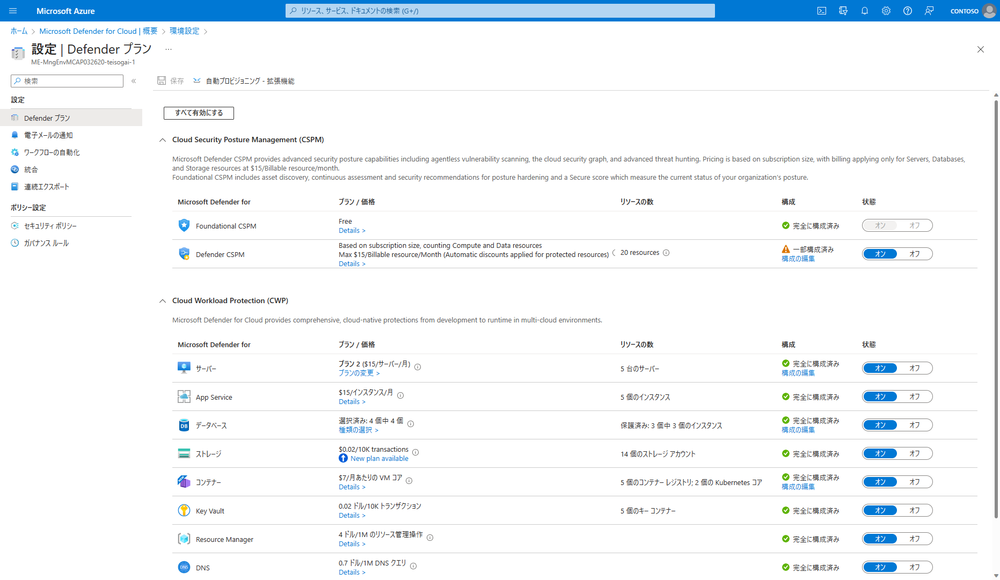
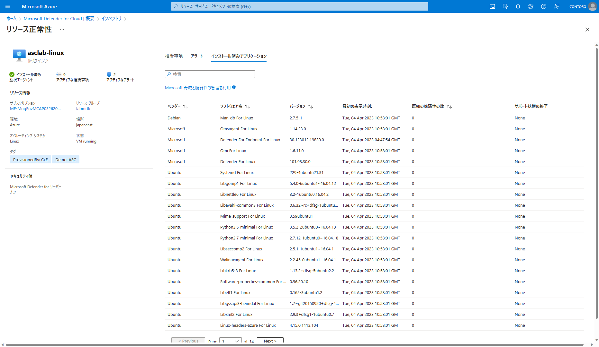

# Microsoft Defender for Cloud の探索
**前提事項**
この Lab を実行するには `Defender for Cloud Lab の準備` を完了している必要があります。

## 目的
Microsoft Defender for Cloud にはさまざまな機能があり、それぞれの機能もたくさんの機能を持っています。
ここでは各機能の概要を広く探索することで、Microsoft Defender for Cloud ができることを Quick に理解することを目的としています。

## ダッシュボード
1. Azure Portal (https://portal.azure.com) にログインします。左上ハンバーガーボタンからメニューを展開し、Microsoft Defender for Cloud をクリックします。Azure Portal の上部の検索バーからもアクセス可能です。
2. `Microsoft Defender for Cloud | 概要` ページが開きます。

ダッシュボードではここでは以下の情報ごとにタイルで区切られており、情報を一目で確認することができます。
- セキュリティ態勢
- 規制コンプライアンス
- ワークロード保護
- インベントリ  
それぞれのタイルの部分をクリックすると、さらに深い情報をみることができます。

3. 画面上部の `サブスクリプション` フィルタボタンを使うと、表示させるサブスクリプションを変更することができます。

4. 画面上部のメニューバーから `Azure サブスクリプション` をクリックします。

5. 環境設定 画面から、該当のサブスクリプションを選択します。

6. 選択したサブスクリプションに対する Microsoft Defender for Cloud プランの選択状況が確認できます。

7. 概要ページに戻り、`セキュリティ態勢` タイルをクリックします。ここでは現在の推奨事項に対する対処状況を基にしたセキュリティスコアが表示されています。

8. 概要ページに戻り、`規制コンプライアンス` タイルをクリックします。規制コンプライアンス ダッシュボード画面が表示されます。
ここでは、各コンプライアンス規制に対する態勢状況を見ることができます。
デフォルトでは以下 4 つの規制について表示させることができます。
- Microsoft cloud security benchmark
- ISO 27001
- PCI DSS
- SOC TSP

9. 概要ページに戻り、`ワークロード保護` タイルをクリックします。ワークロード保護 ダッシュボード画面が表示されます。
選択したサブスクリプション内にある各リソースに対する Defender for Cloud の適用状況が確認できます。

画面中段 セキュリティアラート ペインでは、各ワークロードに対するセキュリティ侵害アラートが表示されます。グラフ部分をクリックするとアラートの詳細が確認できます。

任意のアラートを選んで詳細を表示することもできます。

詳細画面 右側ペインで `アクションの実行` を選択すると、このアラートに対処するためのアドバイスを確認することができます。

10. 概要ページに戻り、`インベントリ` タイルをクリックします。インベントリ ダッシュボード画面が表示されます。
インベントリ画面では Microsoft Defender for Cloud がカバーしているリソースの一覧、エージェントインストールの有無、推奨事項の順守状況などが確認できます。

## セキュリティスコア
前項ではダッシュボード上の各タイルで何が表示されるかを確認しました。ここではセキュリティスコアについてもう少し深く掘り下げていきます。
1. `Microsoft Defender for Cloud | 概要` ページから `セキュリティ態勢` タイルをクリックします。
1. `セキュリティ態勢` ダッシュボードが開きます。現在のセキュリティスコアが表示されます。
1. 上部メニューから `経時的なセキュリティスコア` をクリックします。経時的なセキュリティ スコア 画面が開きます。Workspace に、以前設定した Workspace 名を選択します。

> 設定してすぐの状態だと同グラフは確認できません。余裕を見て 1 週間以上経過した上で確認してください。

## 推奨事項
ここでは推奨事項の表示について確認します。
Microsoft Defender for Cloud の概要ページ > セキュリティ態勢 > 対象のサブスクリプション の `推奨事項を表示する` をクリックします。

セキュリティスコアの元となる推奨事項の順守状況が表示されます。推奨事項の一覧情報を CSV で Export することもできます。

推奨事項の詳細を確認します。`転送中のデータを暗号化する` > `Function App shoud only be accessible over HTTPS` をクリックします。

`Remediation steps` を展開します。`Manual remediation` 欄に対処方法が記載されているのと共に、`Quick fix logic` というボタンが存在します。`Quick fix logic` をクリックします。

自動修復スクリプトの内容 が開きます。閉じる をクリックし前の画面に戻ります。

修復対象のリソースにチェックをし、Fix をクリックします。リソースの修正 画面が開くので、1個のリソースを修正 をクリックします。

暫くすると 通知 欄に「修復が成功しました」とメッセージが出れば修復が完了しています。

推奨事項画面に戻り、Fix した推奨事項を確認してみましょう。この時点ではスコアに反映されておらず、30分以上待つ必要があります。

推奨事項画面に反映された際は以下のように表示されます。

## インベントリ
資産インベントリ ダッシュボードを使用すると、クラウド用 Microsoft Defender の対象となるすべてのリソースを 1 つのウィンドウ ビューで表示できます。
> このダッシュボードは Azure リソース グラフ (ARG) に基づいているため、サブスクリプション間でクエリを大規模にすばやく簡単に実行できます。

Microsoft Defender for Cloud の概要ページ > `インベントリ` をクリックします。
リソースの合計、正常でないリソース、監視されていないリソース、登録されていないサブスクリプションが表示されます。
> リソースの合計 は Microsoft Defender for Cloud に接続されているリソースの合計となります。サブスクリプション内のリソースの合計ではありません。

`asclab-linux` をクリックし、このマシンについての情報を掘り下げてみましょう。このマシンに対する推奨事項、アラート、インストール済みアプリケーションを表示することができます。

インストール済みアプリケーション 画面では、インストールされたパッケージに対する脆弱性評価の結果が確認できます。 **要確認**

インベントリ画面では、画面上部のフィルタで名前、サブスクリプション、リソースグループなど様々な単位で絞り込んだ結果を確認することができます。

`Add Filter` ボタンからはほかにも様々なフィルタ条件を追加することができます。

またこの画面から `リソースタグ` を追加することができます。
1. インベントリ画面からリソースタグを追加したいリソースを選択し、`タグの割り当て` をクリックします。

1. タグの割り当て 画面が開きます。追加したいタグ名と値を入力し、保存をクリックします。

1. しばらくするとタグが適用されます。タグが適用された後はインベントリ画面から割り当てたタグを使ってフィルタすることができます。

推奨事項のカテゴリを検索することも `Add Filter` フィルタから可能です。`セキュリティの調査結果` を選択し、OK をクリックします。

Value 欄には特定の脆弱性の他、キーワード（CVE, KB ID, 名前など）でフィルタすることが可能です。（※以下はサンプルであり今回の Lab では表示されません。）

該当のフィルタ結果を辿っていくことで当該リソースに CVE を含む脆弱性が存在することが確認できます。

> 参考: CVE とは https://www.ipa.go.jp/security/vuln/scap/cve.html

インベントリ画面から `クエリを開く` をクリックすることで、さらに高度な検索を行うことができます。クエリは保存することができ、今後繰り返し実行する場合などに便利です。
> GUI でフィルタをかけた状態で `クエリを開く` をクリックすることで、そのままクエリにも反映されます。クエリを自分で書くのが難しい場合でも利用しやすくなっています。

