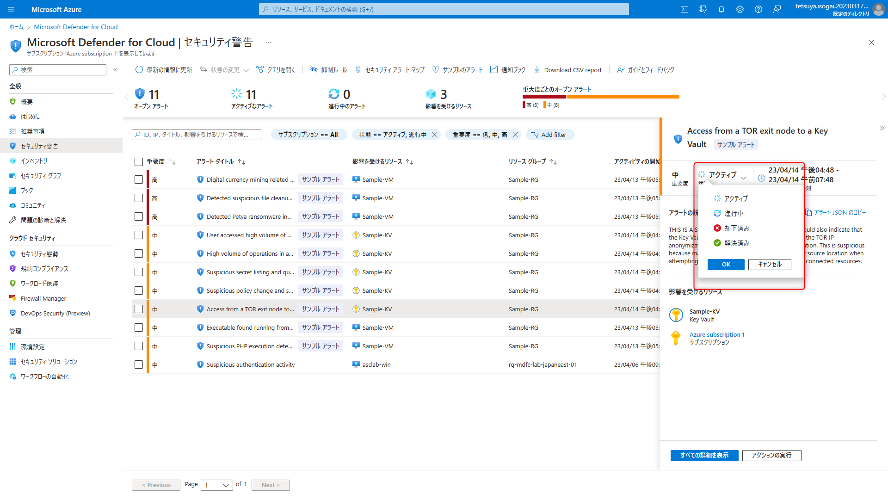

# 規制コンプライアンス
**前提事項**
この Lab を実行するには `Defender for Cloud Lab の準備` を完了している必要があります。

## 目的
本章ではワークロード保護について詳細を確認していきます。

## アラートの検証
1. Microsoft Defender for Cloud 画面で、左側のナビゲーション ペインから **セキュリティ警告** をクリックします。
1. VM のアラートシミュレーションを作成します。
    1. 上部メニューから **サンプルのアラート** ボタンをクリックします。
    
    1. 以下を選択しサンプルアラートを作成します。
    
        - Azure Subsctription 1
        - 仮想マシン のみ選択
    1. **サンプルアラートの作成** をクリックします。
1. 時間が経つと（5分程度）、**サンプルアラート** と表示された 5 つの異なるサンプルイベントが表示されます。
1. **Digital currency mining related behavior detected alert** をクリックします。
1. 詳細画面が開きます。アラートの説明、栄養を受けるリソース、どのような攻撃手段の際に発生するアラートか（MITRE ATT&CK Framework）などが表示されます。

1. さらに詳細な情報を確認するには、**すべての詳細を表示** ボタンをクリックします。
1. Key Vaults に関するアラートを作成します。
 - **セキュリティ警告**ページから、**サンプルのアラート**をクリックします。**サンプル アラートの作成**画面が開きます。サブスクリプション に **Azure Subscription 1** を選択し、**Azure Defender プラン**から**キー コンテナー** を選択します。**サンプル アラートの作成**をクリックします。

1. サンプルアラートが作成中の旨が表示されます。数分後に、**サンプルアラート**と表示された Key Vault 関連のサンプルイベントが表示されます。

1. **Access from a TOR exit node to a Key Vault** をクリックすると詳細を確認できます。

1. 各アラートの状態を変更することができます。このアラートを無視する場合は **却下済み** を選択し OK をクリックします。

## アラートの抑制
アラートがアクション不要であること確認できた場合、または関連性がない場合は、手動で無視できます。前の手順では **却下済み** オプションを使用して、1 つのアラートを手動で無視しました。抑制ルール機能を使用して、今後同様のアラートを自動的に無視できます。
1. Microsoft Defender for Cloud 画面で、左側のナビゲーション ペインから **セキュリティ警告** をクリックします。
1. **High volume of operations in a Key Vault** をクリックし、**アクションの実行**をクリックします。

1. **類似のアラートの抑制** を展開し、**抑制ルールの作成**をクリックします。

1. **New Suppression rule** 画面が開きます。以下を入力します。
    - Subscription: Azure subscription 1
    - Alerts: Custom
    - Rule name: Testing-AutoDismiss-KV
    - Reason: Other
    - Comment: For Excercise
    その他はデフォルトのままにします。**Simulate**ボタンをクリックし、当該ルールの有効性を検証することもできます。問題なければ**Apply**をクリックします。
    
1. 警告画面がでるので OK をクリックします。
1. 作成した抑制ルールを確認します。**セキュリティ警告** 画面上部メニューから**抑制ルール**をクリックします。
1. 作成した抑制ルール("Testing-AutoDismiss-KV") が表示されますのでクリックします。

1. **Rule expiraion** の日付を1か月先に変更して**Apply**をクリックします。警告画面がでるので OK をクリックします。

