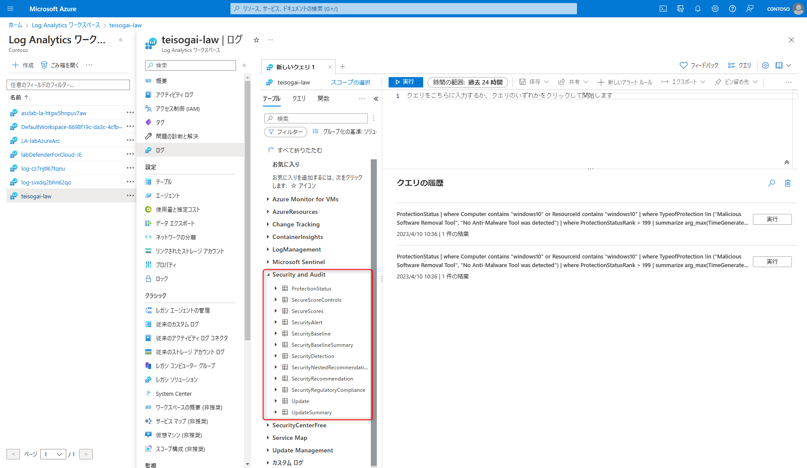
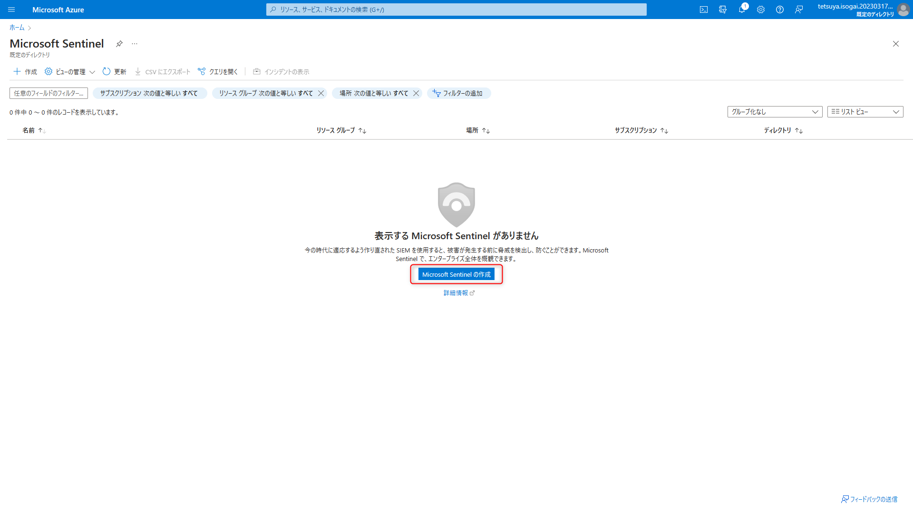
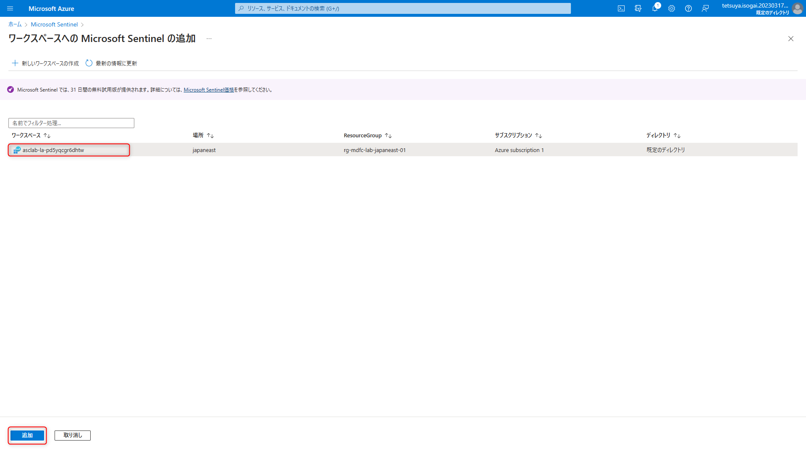
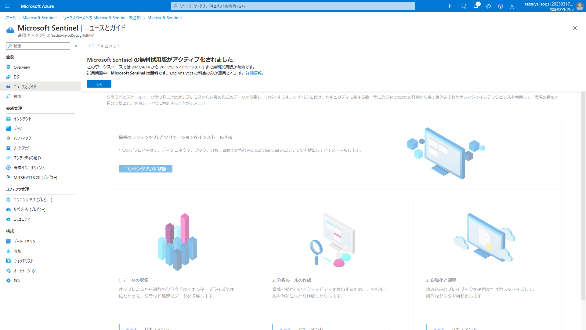
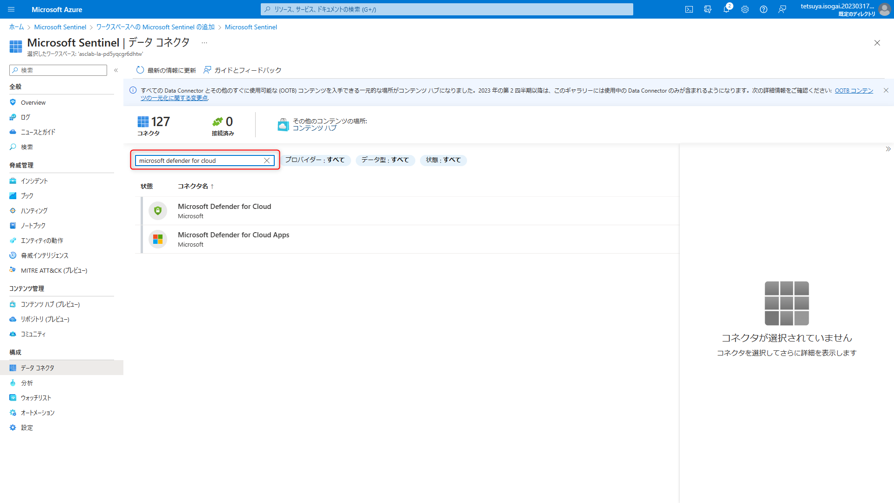
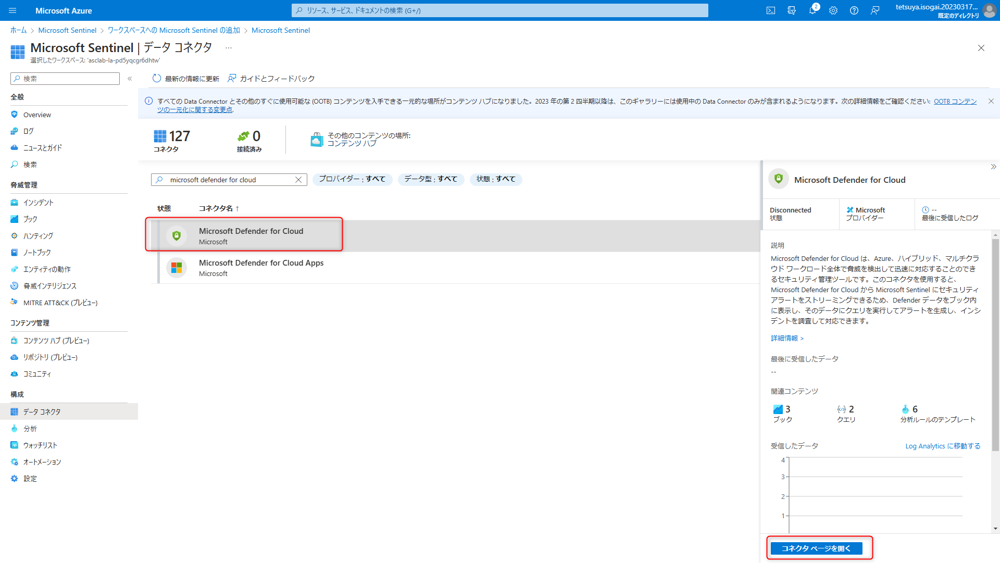
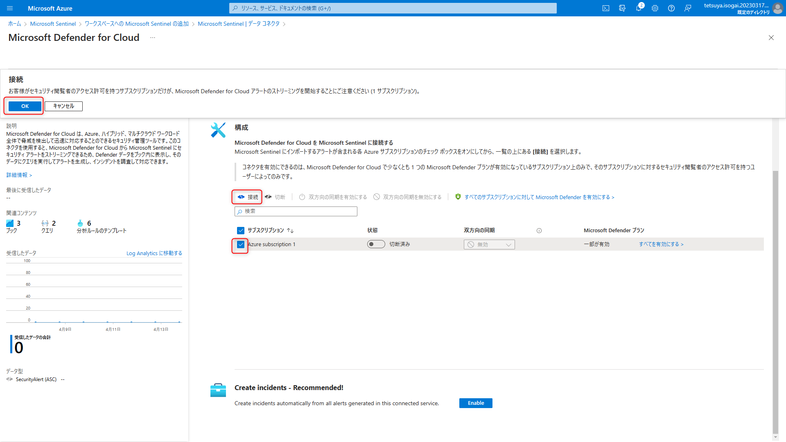

# SIEM へのエクスポート
**前提事項**
この Lab を実行するには `Defender for Cloud Lab の準備` を完了している必要があります。
また Lob Analytics ワークスペースに保存されたログを利用するため、4. 規制コンプライアンス → 継続的エクスポートとコンプライアンスの経時的ワークブック を完了している必要があります。

## 目的
この演習では、Log Analytics ワークスペースの継続的エクスポートを構成し、セキュリティ アラート、推奨事項、セキュリティ スコア、セキュリティ調査結果をエクスポートする方法について説明します。さらに、Microsoft Defender for Cloud と Azure Sentinel の統合を有効にする方法についても学習します。また、Azure Policy のゲスト構成拡張機能を自動プロビジョニングする方法についても説明します。

## 連続エクスポートログの分析
1. asclab-la-xxx ワークスペースをクリックします。
1. ワークスペースのサイドバーから、[ログ]ボタンをクリックします。
1. ようこそページで、[開始]ボタンをクリックし、[クエリ]ウィンドウを閉じます。
1. 左側のウィンドウで、**Security and Audit** を展開します。以下テーブルが確認できます。

## Azure Sentinel との統合
1. Azure Portal から Sentinel サービスに移動します。
1. **Microsoft Sentinel の作成**をクリックします。

1. **ワークスペースへの Microsoft Sentinel の追加** 画面が開きます。**asclab-la-xxx** ワークスペースを選択し、追加 をクリックします。

1. Sentinel をワークスペースに追加するプロセスが開始されます。数分かかります。
1. Sentinel がアクティブ化されると以下の画面が開きます。OK をクリックします。

1. 左側メニューから **データ コネクタ** を開きます。データコネクタ 画面で中央の検索ボックスを使用し Microsoft Defender for Cloud を検索します。

1. 選択し、**コネクタ ページを開く** をクリックします。

1. 該当のサブスクリプションにチェックし、接続 ボタンをクリックします。警告画面が出るので OK をクリックします。

1. 双方向同期が有効になっていることを確認します。※時間がかかります

※WIP
